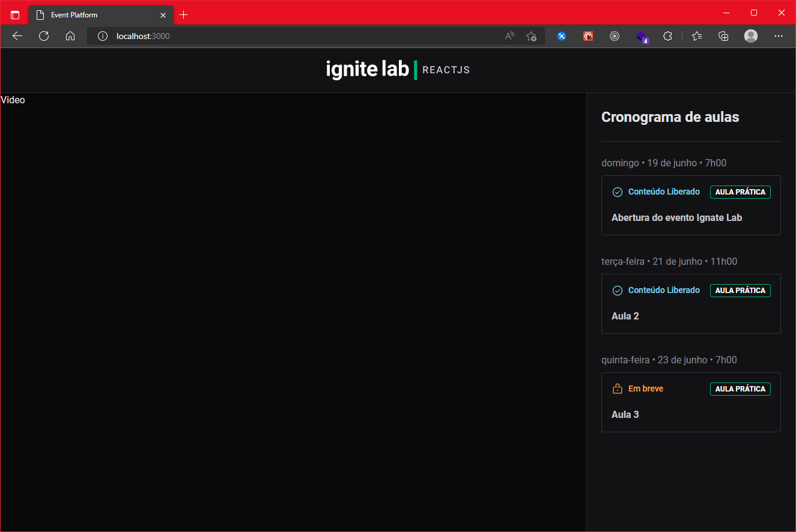
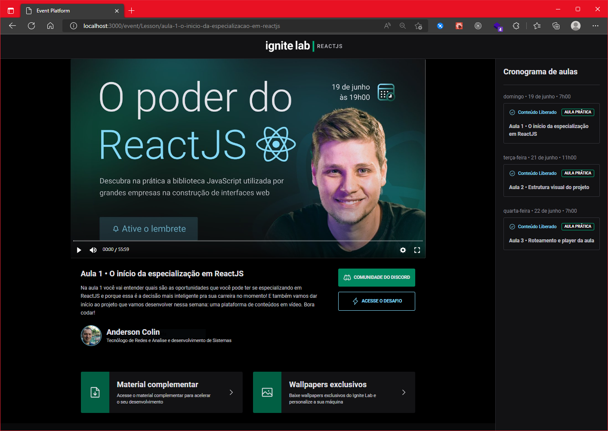
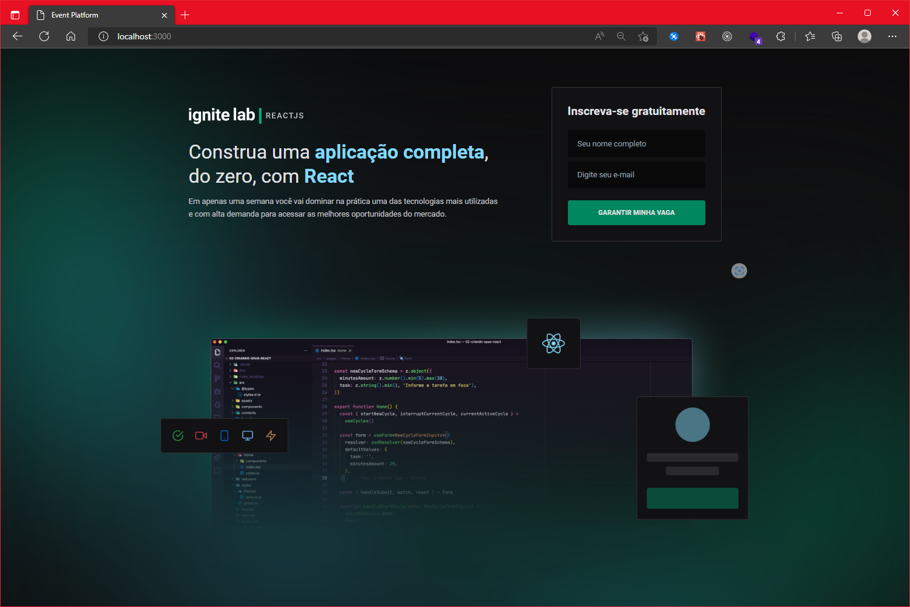
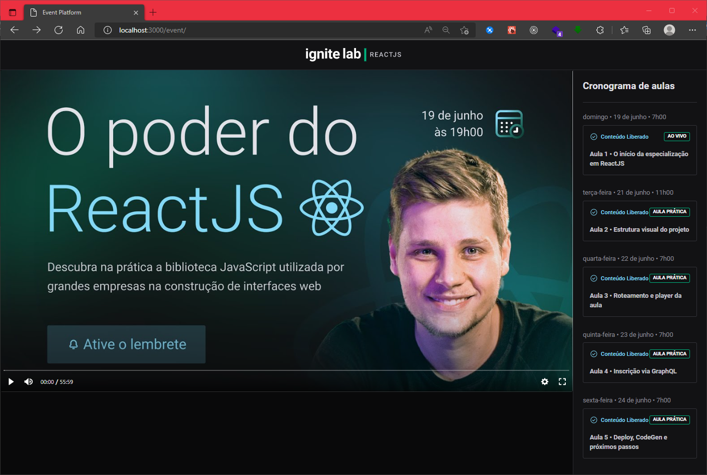

IgniteLab-React--Rocketseat
========
Repositório criado para hospedar aplicação desenvolvida durante o IgniteLab da Rocketseat  onde realizamos o Desenvolvimento de uma plataforma de conteúdos em vídeo parecida platataforma de eventos da Rocketseat, utilizando tecnologias: ReactJS, GraphQL, GraphCMS, Apollo Client e TailwindCSS

---

Aula 02 - Estrutura Visual do Projeto
--------

Desenvolvimento da estrutura visual do projeto conexão da sidebar com o graphCMS, instalação das bibliotecas: 

* phosphor-react - biblioteca de icones -- [Phosphor - https://phosphoricons.com/  ](https://phosphoricons.com/ )

	`npm -i phospor-react `
	
* date-fns - biblioteca para formatação de datas

	`npm -i date-fns`

#### Tema tailwind

> Configuração da paleta de cores do designe no tailwind.config.js 

~~~tailwind.config.js
colors: {
  green: {
    300: '#00B37E',
    500: '#00875F',
    700: '#015F43',
  },
  blue: {
    500: '#81D8F7',
  },
  orange: {
    500: '#FBA94C',
  },
  red: {
    500: '#F75A68',
  },
  gray: {
    100: '#E1E1E6',
    200: '#C4C4CC',
    300: '#8D8D99',
    500: '#323238',
    600: '#29292E',
    700: '#121214',
    900: '#09090A'
  }
},
~~~

---

### *Notas:*

[site svq2jsx - tranformar imagens svg em component React- https://svg2jsx.com/  ]( https://svg2jsx.com/ )

[Layout da aplicação no Figma: ](https://www.figma.com/file/mjAR2Z0BlF51x1Ss6bJARU/Plataforma-de-evento---Ignite-Lab-(Community)?node-id=8%3A399)

---

Aula 03 - Roteamento e player da aula
--------

Continuação do projeto, desenvolvendo o roteamento e player de vídeo, com a descrição, botões, e links para recursos extras. 

instalação das bibliotecas: 

* [react-router-dom  ](https://reactrouter.com/docs/en/v6) - biblioteca de roteamento 

	`npm -i react-router-dom`
* [vimejs  ](https://vimejs.com/) - biblioteca de player de vídeo

	`npm -i react-router-dom`

---
Aula 04 - Inscrição via GraphQL
--------

Continuação do projeto, adicionado a pagina principal para inscrição, cadastrando o usuário no GraphCMS.

Estilizado o card Lesson para ficar verde ao ser selecionado.

instalação das bibliotecas: 

* [classnames  ](https://www.npmjs.com/package/classnames) - biblioteca para adicionar condicionais nos estilos. 

  `npm -i classnames`

---

Aula 04 - Deploy, CodeGen e próximos passos
---------

Instalado CodeGen para realizar a tipagem do schema da API GraphCMS, refatorado o código para utilizar os hooks da API que o CodeGen criou.

Adicionado mais dois componentes ***Abertua.tsx*** para  adicionar o vídeo de abertura do evento e ***FormScubscribe.tsx*** para separar o form da pagina inicial e deixar o código mais clean.

instalação das bibliotecas: 

* [GraphQL - Codegen](https://www.graphql-code-generator.com/) - biblioteca de tipagem do schema GraphQL

  ~~~npm
  npm i @graphql-codegen/typescript @graphql-codegen/typescript-operations @graphql-codegen/typescript-react-apollo
  ~~~
  
  

